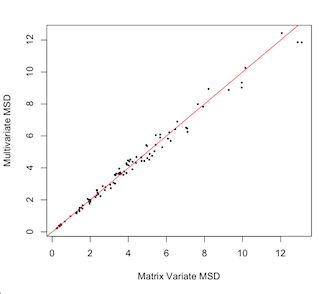
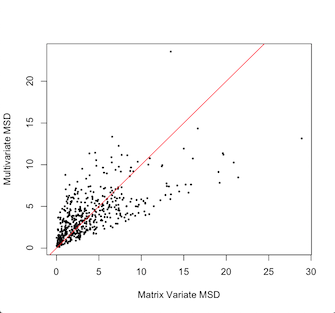

# A Short Guide for MatrixVariate

## Installation
To download the package simply run
```julia
add https://github.com/nikpocuca/MatrixVariate.jl
```
in pkg mode within a julia repl.

## Features

### MatrixNormTest

A simple framework for assessing the matrix variate normality of data.
by Nik Počuča

- [Paper](https://www.google.com)
- [Github](https://github.com/nikpocuca/MatrixNormTest.jl)

 

### Main Test
The function for the main test of matrix variate normality in a dataset.
- X is an r x c x N array.
- α is power level.
- iter is the number of mle iterations for the matrix variate MLE estimate.

```@docs
MatVTest(X::Array{Float64,3};α::Float64 = 0.05,iter::Int64 = 100)
```

### Plotting and Summary
DD plot function, that takes in a MatrixNormTest object and plots the distances along the reference line.
```@docs
ddplot(mat_test::MatrixVariateNormalTest)
```
An Example
```julia
using RCall, MatrixNormTest

# example data function
mat_data = MatrixNormTest.example_data();
X_A = mat_data[1];
X_B = mat_data[2];

# Matrix Variate Normality
mtest_A = MatVTest(X_A);
print(mtest_A.ks_test);
ddplot(mtest_A);

# Failure of Matrix Variate Noramlity
mtest_B = MatVTest(X_B);
print(mtest_B.ks_test);
ddplot(mtest_B);

```

### Objects
MatrixVariateNormalTest object

An object that contains all necessary information for a matrix variate normality test

- matrix distances, d_mat
- multivariate distances, d_mat
- Kolmogorov Smirnov Test, ks_test
- P Value, p_val
```@setup norm_struct
using HypothesisTests
```
```@example norm_struct
mutable struct MatrixVariateNormalTest
  d_mat::Array{Float64,1};
  d_mult::Array{Float64,1};
  ks_test::ApproximateTwoSampleKSTest;
  p_val::Float64
end
```
